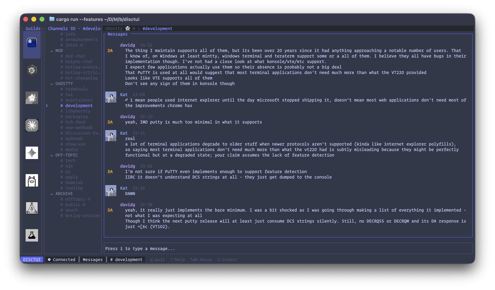

<p align="center">
  <a href="https://github.com/blacktop/disctui"></a>
  <!--<h1 align="center">disctui</h1>-->
  <h4><p align="center">A fast, minimal Discord TUI with AI-powered conversation summaries</p></h4>
  <p align="center">
    <a href="https://github.com/blacktop/disctui/actions" alt="Actions">
          </a>
    <a href="https://github.com/blacktop/disctui/releases/latest" alt="Downloads">
          </a>
    <a href="https://github.com/blacktop/disctui/releases" alt="GitHub Release">
          </a>
    <a href="http://doge.mit-license.org" alt="LICENSE">
          </a>
</p>
<br>



`disctui` is a terminal-first Discord client for reading guilds, DMs, and message history with a clean multi-pane layout, mute-aware unread state, inline media, and optional AI summaries.

> [!WARNING]
> `disctui` is an unofficial Discord user-token client.
> Using it may violate Discord's Terms of Service and can put your account at risk.
> Use a throwaway account and do not reuse your primary account.

> [!IMPORTANT]
> This is a user-token client, not a Discord bot.
> You authenticate with a Discord user token, either through `DISCTUI_TOKEN` or the macOS Keychain.

> [!TIP]
> For the best rendering experience, we recommend using [Ghostty](https://ghostty.org/).
> `disctui` should still look good in other modern terminals.

## Install

### Homebrew (macOS)

```sh
brew install blacktop/tap/disctui
```

### GitHub Releases

1. Download the latest release from [GitHub Releases](https://github.com/blacktop/disctui/releases).
2. Extract the archive.
3. Move the `disctui` binary into your `PATH`:

```sh
chmod +x disctui
mv disctui /usr/local/bin/
```

### Build From Source

```sh
git clone https://github.com/blacktop/disctui.git
cd disctui
cargo build --release --features experimental-discord
./target/release/disctui
```

### Dev Shortcuts

This repo includes a `justfile` for common workflows:

```sh
just build
just check
just bump-patch
just dist-build
```

## Auth

`disctui` resolves your Discord token in this order:

1. `DISCTUI_TOKEN`
2. macOS Keychain entry `service=disctui`, `account=discord_token`
3. startup token prompt

If no token is found, `disctui` opens a modal token prompt at startup. When you paste a token and press Enter, it stores the token in the macOS Keychain and then attempts to connect.

You can still set the token manually for one session:

```sh
DISCTUI_TOKEN=... disctui
```

## Features

- Guild, channel, and Direct Messages navigation
- Virtual `Direct Messages` rail backed by Discord private channels
- Mute-aware unread behavior for guilds and channels
- Startup token prompt with macOS Keychain storage
- Inline image and avatar rendering when terminal support is available
- AI-powered unread summaries for active conversations
- Ghostty-friendly loading feedback for visible async refreshes

## Configuration

Config file search order:

- macOS: `~/Library/Application Support/disctui/config.toml`
- XDG-style fallback: `~/.config/disctui/config.toml`

Start from [`config.toml.example`](./config.toml.example).

Current config keys include:

- `tick_rate_ms`
- `mouse`
- `ai_backend`
- `ai_base_url`
- `ai_model`

## Logging

Debug logging is off by default.

Enable it for one session:

```sh
disctui --debug
```

Logs are written to:

- macOS: `~/Library/Application Support/disctui/disctui.log`

State is stored in:

- macOS cache DB: `~/Library/Caches/disctui/disctui.db`

## Limitations

- This project uses a Discord user token and is not an officially supported client.
- Release binaries always include Discord support via the `experimental-discord` feature.
- The startup token prompt currently assumes macOS Keychain support for persistence.
- Local read-state clearing for DMs still depends on Discord providing a usable `last_message_id`.

## License

MIT. See [LICENSE](./LICENSE).
